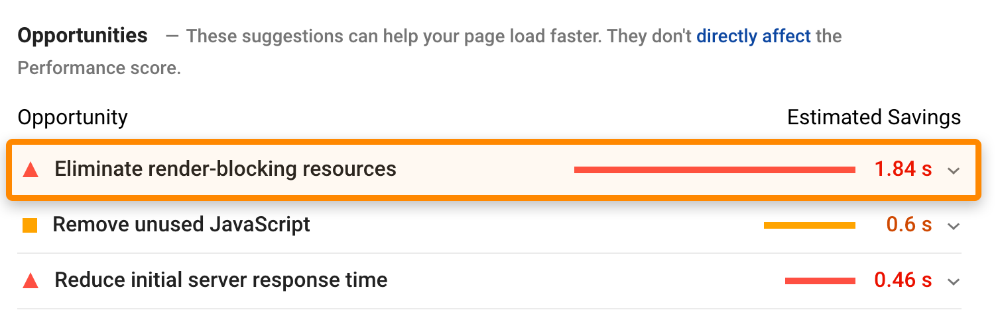

Кто проверял свои сайты в сервисе Google Pagespeed тот уже видел рекомендации «Eliminate render-blocking resources».

Рендеринг — это процесс превращения кода в видимую веб-страницу.

Ключевым словом здесь является «видимая», поскольку веб-страница не всегда должна полностью загрузиться, прежде чем ее можно будет увидеть.

По этой причине имеет смысл отдавать приоритет загрузке ресурсов для контента, находящегося в верхней части страницы.

Вы можете сделать это, отложив загрузку некритичных файлов CSS и JavaScript, необходимых для содержимого «в нижней части страницы», на более позднее время.
