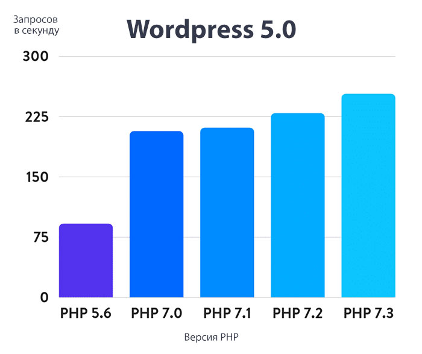

# Свежие версии WordPress и PHP

Создатели WordPress постоянно работают над улучшением своей Системы Управления. Новые версии CMS имеют лучшую производительность и оптимизированный код.

WordPress в основном написан на языке программирования PHP. Это язык на стороне сервера, что означает, что он устанавливается и работает на вашем хостинг-сервере.

Все хорошие хостинг-компании WordPress используют на своих серверах самую стабильную версию PHP. Однако возможно, что ваша хостинг-компания использует более старую версию PHP.

Новая версия PHP 7 в два раза быстрее своих предшественников. Это огромный прирост производительности, которым должен воспользоваться ваш сайт.

Если на вашем сайте используется версия ниже PHP 7, попросите хостинг-провайдера обновить ее для вас.

В 2026 году работать с версией PHP для WordPress ниже 8.3 уже не рекомендуется!
