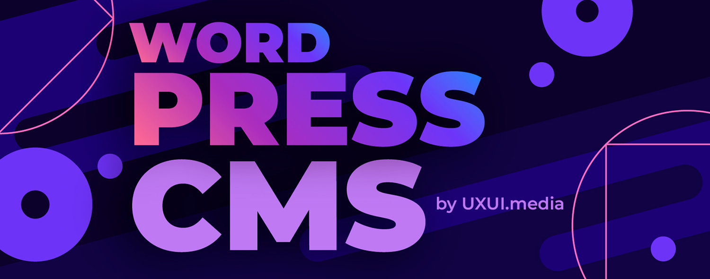

# Оптимизация и ускорение WordPress :rocket: (wordpress-optimization-tools)

Здесь собираются основные советы и рекомендации по ускорению и оптимизации WordPress сайтов.

**Официальный сайт**: <https://wordpress.org/>

Руководство затрагивает два больших понятия — ускорение и оптимизация WordPress сайтов. Материал будет постоянно дополняться и обновляться по мере сил и возможностей. Нужно также понимать, что не все способы нужно использовать, а некоторые способы ускорения могут помешать другим методам, поэтому в выборе нужных решений лучше консультироваться со специалистами.  

Стоит сказать , что здесь мы рассмотрим вопросы именно внутренней оптимизации сайтов и их правильной функциональности, т.е. постараемся сделать так, чтобы поисковые системы лучше относились к сайту.  

| # | Фича | Комментарий |
|---|---|---|
| 001 | [001 Remove unused plugins](./001%20Remove%20unused%20plugins/README.md) | Удаляем неиспользуемые плагины |
| 002 | [002 Switching to Cloudflare](./002%20Switching%20to%20Cloudflare/README.md) | Переходим на Cloudflare |
| 003 | [003 Installing the caching plugin](./003%20Installing%20the%20caching%20plugin/README.md) | Установка плагина кэширования |
| 004 | [004 Minifying and combining](./004%20Minifying%20and%20combining/README.md) | Минификация и объединение JavaScript и CSS файлов |
| 005 | [005 Eliminate render-blocking resources](./005%20Eliminate%20render-blocking%20resources/README.md) | Устранение ресурсов, блокирующих рендеринг |
| 006 | [006 Lazy loading](./006%20Lazy%20loading/README.md) | Ленивая загрузка изображений и видео |
| 007 | [007 Preload](./007%20Preload/README.md) | Включение предварительной загрузки |
| 008 | [008 Latest versions](./008%20Latest%20versions/README.md) | Свежие версии WordPress и PHP |

<a href="#totop">&uarr; Наверх</a>

